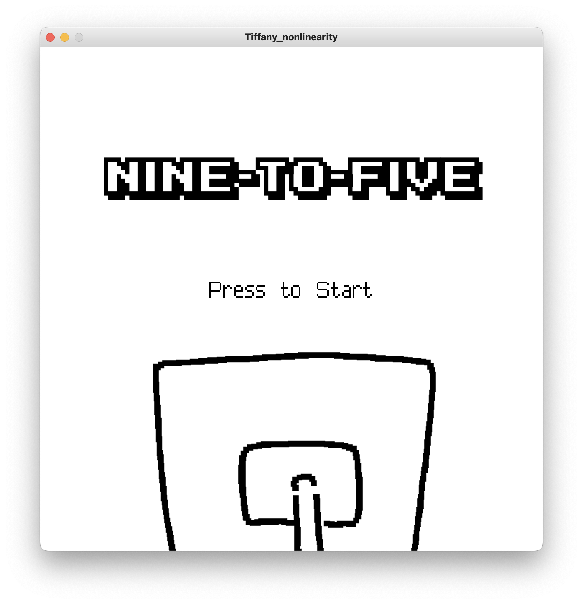
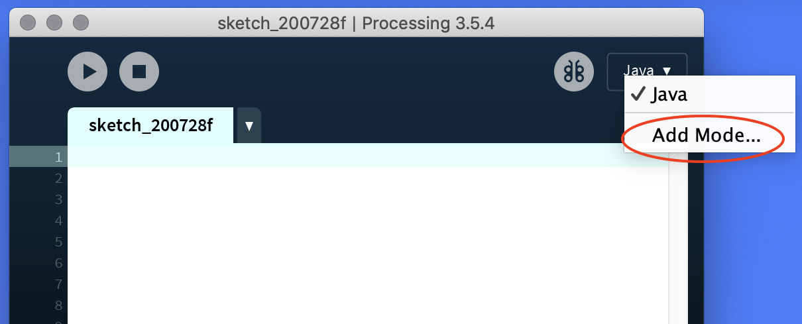
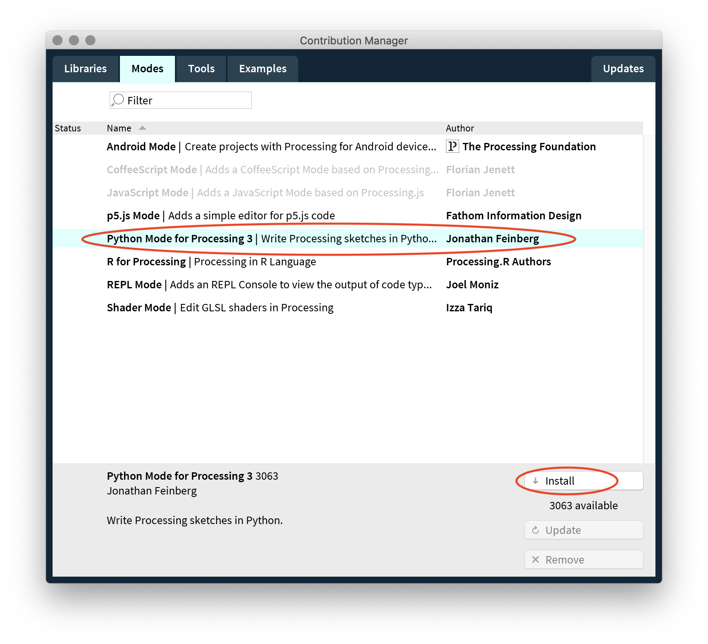
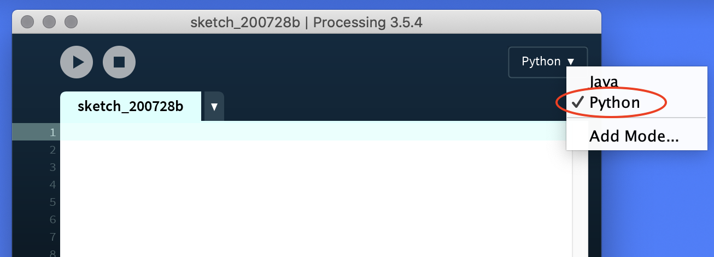

# Nine-To-Five
*Nine-To-Five* is an interactive story game that follows the usual (or unusual) day of an average office worker. A blend of text and images are used to immerse players in the pixelated world that the office worker has come to inhabit. The game explores themes of memory and fantasy in a modern-day context.

  
  
  

## Setup
To run this program or sketch, you will need to use the Processing IDE.

Download >>> version 3.5.4 <<< from the [Processing website](https://processing.org/releases) for whichever operating system and hardware you are using.

Processing doesn't include support for the Python programming language by default. So enable Python support by installing an add-on called **Python Mode**. You can do this by opening the IDE and clicking on the drop-down menu on the right side of the tool bar and selecting "Add Mode..."

   

A window with the title "Mode Manager" will appear. Scroll down until you see "**Python Mode for Processing 3**" (not 4) and press "Install."

   

After you do this, quit Processing and re-open it. You should then be able to select Python under the mode menu.

   
   

You're all set up! Run the game by opening this project folder from the "File" dropdown in the upper toolbar and clicking the "play" icon or typing Command + R.
